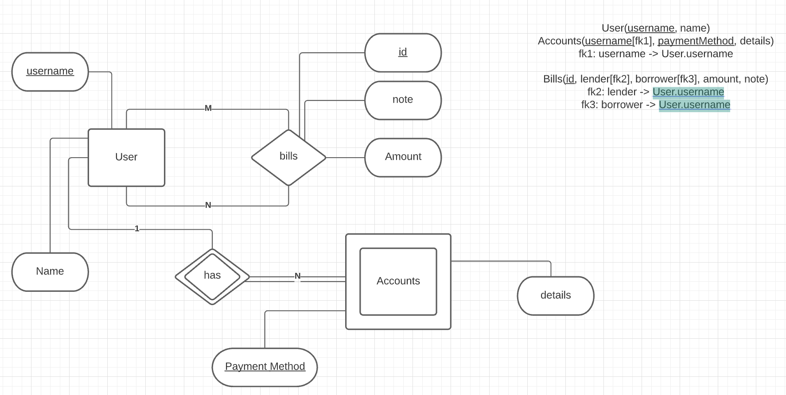
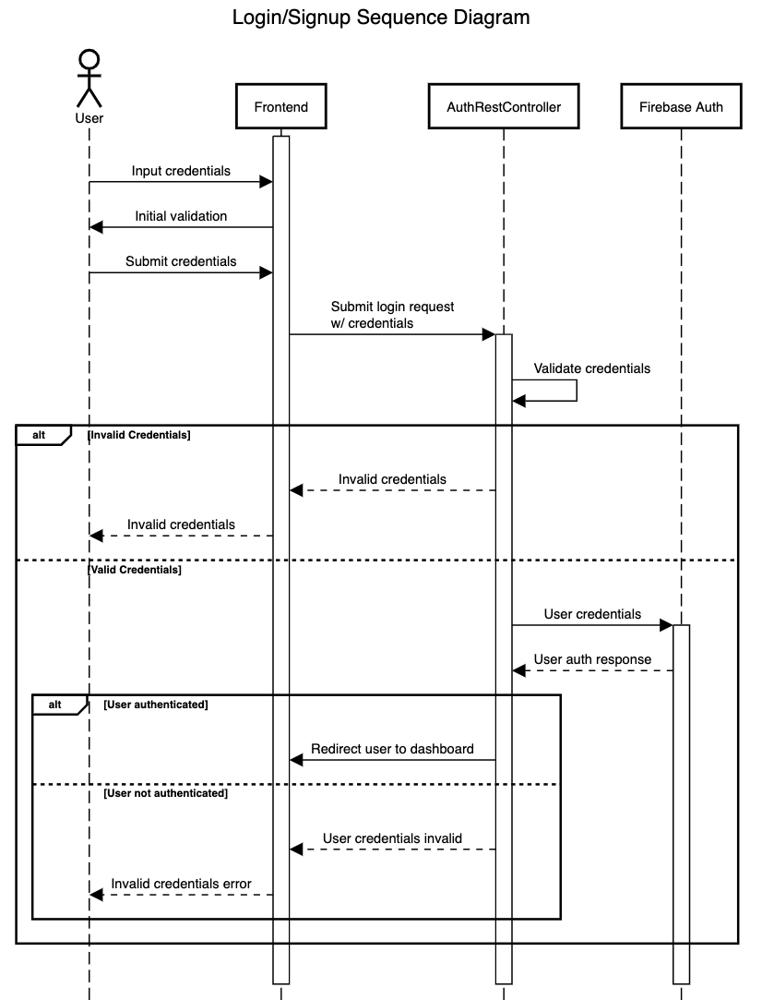
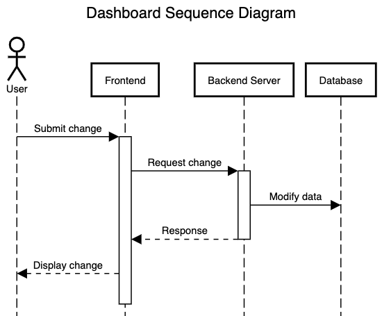
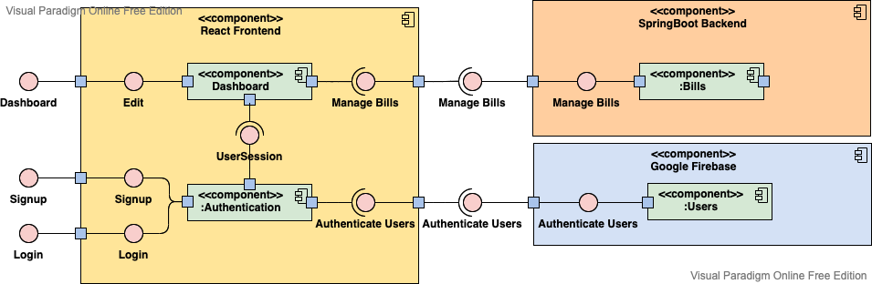

# Project Report: Bill Splitter

[Link](https://bill-splitter-frontend-333603.uc.r.appspot.com)

## Overview

### Executive Summary

Bill Splitter is a web application that allows users to input the total amount of a bill and split the bill between a variable number of friends. Those friends receive payment requests from the user and have the ability to pay the friend back through different payment methods. The money is then deposited in the user’s payment account. In many situations one person pays the bill for convenience, and this app can easily determine how each friend should pay back that one person.

### Project Lifecycle

We went with waterfall because our project is relatively small and we knew all of the requirements up front and there is a relatively short timeframe for the project.

### Distribution of Work

Enioluwa Daniel Adebisi - Assisted front end 
Mukhtar Kussaiynbekov - Deploy Spring and React applications to App Engine, Implement REST APIs using Google Cloud MySQL database
Zach McGee - Setup Spring application, Dashboard page, Team manager
Samuel Zhang - Testing, Item submission input validation
Chunhao Zou - Item submission, Bill splitting function, Authentication

### Definitions of Acronyms

| Term                 | Definition                                                                                                                                                                                                   |
| -------------------- | ------------------------------------------------------------------------------------------------------------------------------------------------------------------------------------------------------------ |
| GCP                  | Google Cloud Platform, a suite of cloud computing services such as web app hosting, database hosting, or virtual machine provided by Google.                                                                 |
| HTML                 | HyperText Markup Language is a markup language that defines the structure of a web page                                                                                                                      |
| CSS                  | Cascading Style Sheets is a styling language that describes what the visual representation of different elements on a web page should be like                                                                |
| JS                   | JavaScript is a high-level, just-in-time compiled programming language used in a browser                                                                                                                     |
| JWT                  | JSON Web Token. It contains a header that specifies encryption information, a payload that tells the information of a user, and a signature the back-end server uses to check whether the user is legitimate |
| Firebase             | A platform developed by Google for building web apps. It contains data storage and authentication functionalities                                                                                            |
| API                  | Application programming interface                                                                                                                                                                            |
| Test Case            | A set of conditions, input variables, testing procedure, and expected results that is being executed to determine whether an application is working correctly                                                |
| Finite State Machine | Represents a finite number of states and the events or actions that cause the transitions between the states. Abbreviated as FSM.                                                                            |
| Test #               | Test Case Number / Identifier                                                                                                                                                                                |
| Requirement          | Requirement that the test cases are validating  (number / identifier)                                                                                                                                        |
| Action               | Action to perform or input to produce                                                                                                                                                                        |
| Expected Result      | Result expected when action is complete                                                                                                                                                                      |
| Actual Result        | What was actually seen                                                                                                                                                                                       |
| P / F                | Pass / Fail indicator. Checkmark = Pass. “F” = Fail                                                                                                                                                          |
| Notes                | Additional notes, error messages, or other information about the test.                                                                                                                                       |
| WebSocket            |An application-layer computer communications protocol that thinly wraps the transport-layer TCP protocol. It allows a server and a client to communicate bi-directionally|
|Event                 |A real-life activity that involves a bill, e.g. trip to Seattle, shopping at Target, or having dinner at a local restaurant|
|Item                  |A thing that costs money|

## Design

### Considerations

#### Assumptions

Continuous connection of internet (server requests and page requests are handled non statically and require authentication, without internet the page will not work)

Assumed they were accessing from a web browser and not mobile

Accessed via a browser supporting HTML5, JS, CSS, JS,

#### Constraints

Time constraint (3-4 weeks total)

Team scheduling conflicts with the Holidays and final assignments for other classes

Project had to be more complex than Project 1

### Architectural Design

#### Overview

Our project consists of two parts: a front-end React application, and a back-end web application that serves as a REST API for the application. The REST API handles everything from user authentication, creating events (real-life activities that involves a bill, e.g. trip to Seattle, shopping at Target, or having dinner at a local restaurant), to editing items to bills. We utilize Spring Boot as the back-end framework and use Maven for dependency management. To implement user authentication and management, we use the Google Firebase SDK to query user data from the remote database and create (and verify) user ID Tokens (JSON Web Token, a.k.a. JWT).

The React application contains four web pages: a login page, a signup page, a dashboard page, and a bill splitter page that allows the user to manage their account and handle splitting bills. To log in, the React application communicates with the REST API with Axios, and stores the JWT Token in localStorage to save user login status. When performing requests, the JWT Token will be attached to the header, and the server will only return the results when the tokens are valid. When collectively editing bills, every user can add or delete items in the bill. When they make requests to update the bill, they send a WebSocket message to the server. The server, upon receiving the message, updates the bill accordingly, and broadcast updates to all users involved in the bill.

Our project is a hybrid of three different architectural styles: event-driven architecture, client-server architecture, and representational state transfer architecture. Event-driven architecture is used in the React application, where a user-generated event such as onLoginButtonClick causes the web page to send a login HTTP request to the Firebase server, with user credentials as the payload, and, upon receiving the response, navigate the user to the dashboard page. Client-server architecture is manifested in the interaction between the user and the server, where each client HTTP request corresponds to a server response. The representational state transfer architecture is involved with API calls, such as login requests. The request and response body, carrying user email/passwords and tokens respectively, are encapsulated in JSON format. 

### Low Level Design

A bill splitter must be synchronous and provide real-time updates of bill information. When multiple users are editing the bill, they should see changes made by other users immediately. Traditional methods to achieve such synchronicity require constant polling, which is highly inefficient and increases server loads. In order to achieve high efficiency, we use the WebSocket protocol. WebSocket is an application-layer protocol that thinly wraps the transport-layer TCP protocol. It allows a server and a client to communicate bi-directionally once they establish a connection. It is unlike the traditional HTTP requests, where a client actively requests for information and a server only passively replies to client requests. In addition, the server can broadcast a message to all recipients. Multicasting is not anything easily achievable with pure HTTP. 

#### Database Diagram

#### Sequence Diagram

#### Component Diagram

## Testing

We conduct both unit testing and system testing. For unit testing, the process is fully automated, with just inputs and expected outputs given. We deem the testing process complete if and only if the unit tests show that no test cases fail. For system testing, a test result is accepted if and only if all the desired outputs outlined in section 4 have been achieved.

#### Bug Tracking

Bug tracking will be done through Github (specifically, the "Issues" feature). This allows us to easily assign fixing a bug to specific people and the status of the issue. This also enables easy tracking of the changes made to resolve bugs if we link pull requests to an issue, so others can check if the issue is really fixed or if a particular change addressing a bug breaks anything else (which likely implies some underlying logic is unviable).

### Test Strategy

The main types of testing done for this project are unit testing and system testing. 
Unit testing is to be relevant for the individual frontend components: the dashboard and authentication pages. The login, signup, and dashboard pages’ inputs are based on user input into text fields and the response from a third-party API or our backend REST API, so the majority of the test cases revolve around user inputs being valid parameters for the APIs and the response from the API (i.e. Firebase Authentication returning whether the user credentials are valid).

Not very much testing needs to be done on the backend since it is composed of existing  frameworks (Springboot) that should be correct on their own and simple database calls for the REST API. However, testing is necessary to ensure the modules we produced are compatible with the system they rely on. System testing makes the most sense for this project since there are no use cases where modules are used individually/separately and the project is relatively small. The four main components are authentication (login/signup frontend), the dashboard, Firebase Admin (managing cookies for dashboard access), and Springboot (server backend). They are very difficult to separate and should be tested as a whole. The main testing method used to ensure integration will be model-based testing, since there are very discrete states that the program is spent in (signing up, logging in, logged in/accessing clean dashboard, logged in/loaded dashboard results). White-box testing would take too much time for this project, since there are many branches/conditions that do not significantly change much (i.e. long if-else chains for input validation) and can be tested by unit testing anyways.

Since this is a relatively small-scale project, we don't have a lot of non-functional requirements that would significantly impact the application. Most relevant would be determining usability and efficiency. Looking at the browser developer console, most of the loading time is spent waiting for responses from external APIs, so the application is efficient enough. Usability is tested by asking a team member who did not work on the interface to use the application without seeing it before and asking for feedback.

### Test Cases

| Test # | Requirement or Purpose                      | Action / Input                                                                                                                                                                         | Expected Result                                                                                              | Actual Result                                                                                                | P/F |
| ------ | ------------------------------------------- | -------------------------------------------------------------------------------------------------------------------------------------------------------------------------------------- | ------------------------------------------------------------------------------------------------------------ | ------------------------------------------------------------------------------------------------------------ | --- |
| 1      | Add Bill Item                               | Open the bill item input page in Firefox. Enter an item name, price, and quantity. Click the Update Item button.                                                                       | The page displays the newly added item and is stored in the Google Cloud database.                           | The page displays the newly added item and is stored in the Google Cloud database.                           | P   |
| 1.a    | Item Name not allowed to be Empty           | Enter an empty item name, random positive float for price, and random positive integer for quantity. Click the Update Item button. {"", 0.05, 2}                                       | The encodeItem() function returns null and the user is alerted empty names are not allowed.                  | The encodeItem() function returns null and the user is alerted empty names are not allowed.                  | P   |
| 1.b    | Special Characters not allowed in Item Name | Enter an item name with special characters, random positive float for price, and random positive integer for quantity. Click the Update Item button. {"!@#$%^&\*(){}\[\]\\/", 0.05, 2} | The encodeItem() function returns null and the user is alerted names cannot have special characters in them. | The encodeItem() function returns null and the user is alerted names cannot have special characters in them. | P   |
| 1.c    | Space-only Item Name not allowed            | Enter an item name with only spaces, random positive float for price, and random positive integer for quantity. Click the Update Item button. {"   ", 0.05, 2}                         | The encodeItem() function returns null and the user is alerted that names cannot be whitespace only.         | The encodeItem() function returns null and the user is alerted that names cannot be whitespace only.         | P   |
| 1.d    | Price value cannot be NaN                   | Enter an alphanumeric item name, random string for price, and random positive integer for quantity. Click the Update Item button. {"test123", "abc", 2}                                | The encodeItem() function returns null and the user is alerted that price must be a positive number.         | The encodeItem() function returns null and the user is alerted that price must be a positive number.         | P   |
| 1.e    | Price value cannot be negative              | Enter an alphanumeric item name, random negative float for price, and random positive integer for quantity. Click the Update Item button. {"test123", -1.23, 2}                        | The encodeItem() function returns null and the user is alerted that price must be a positive number.         | The encodeItem() function returns null and the user is alerted that price must be a positive number.         | P   |
| 1.f    | Price value cannot be zero                  | Enter an alphanumeric item name, zero for price, and random positive integer for quantity. Click the Update Item button. {"test123", 0, 2}                                             | The encodeItem() function returns null and the user is alerted that price must be a positive number.         | The encodeItem() function returns null and the user is alerted that price must be a positive number.         | P   |
| 1.g    | Quantity value cannot be NaN                | Enter an alphanumeric item name, random positive float for price, and random string for quantity. Click the Update Item button. {"test123", 0.05, "xyz"}                               | The encodeItem() function returns null and the user is alerted that quantity must be a positive integer.     | The encodeItem() function returns null and the user is alerted that quantity must be a positive integer.     | P   |
| 1.h    | Quantity value cannot be negative           | Enter an alphanumeric item name, random positive float for price, and random negative integer for quantity. Click the Update Item button. {"test123", 0.05, -2}                        | The encodeItem() function returns null and the user is alerted that quantity must be a positive integer.     | The encodeItem() function returns null and the user is alerted that quantity must be a positive integer.     | P   |
| 1.i    | Quantity value cannot be zero               | Enter an alphanumeric item name, random positive float for price, and zero for quantity. Click the Update Item button. {"test123", 0.05, 0}                                            | The encodeItem() function returns null and the user is alerted that quantity must be a positive integer.     | The encodeItem() function returns null and the user is alerted that quantity must be a positive integer.     | P   |
| 1.j    | Quantity value cannot be a float            | Enter an alphanumeric item name, random positive float for price, and random positive float for quantity. Click the Update Item button. {"test123", 0.05, 0.02}                        | The encodeItem() function returns null and the user is alerted that quantity must be a positive integer.     | The encodeItem() function returns null and the user is alerted that quantity must be a positive integer.     | P   |
| 1.k    | Successful bill item submit (integer price) | Enter an alphanumeric item name, random positive float for price, and random positive integer for quantity. Click the Update Item button. {"test123", 7, 2)                            | The encodeItem() function returns a non-null JSON object and displays the new item on the webpage.           | The encodeItem() function returns a non-null JSON object and displays the new item on the webpage.           | P   |
| 1.l    | Successful bill item submit (float price)   | Enter an alphanumeric item name, random positive float for price, and random positive integer for quantity. Click the Update Item button. {"test123", 0.05, 2}                         | The encodeItem() function returns a non-null JSON object and displays the new item on the webpage.           | The encodeItem() function returns a non-null JSON object and displays the new item on the webpage.           | P   |
| 2      | Sign up                                     | Open the web application in Firefox. Navigate to /signup.                                                                                                                              | The sign up page displays username and password input fields.                                                | Sign up page displays username and password input fields.                                                    | P   |
| 2.a    | Empty Input Validation                      | Ensure all inputs are empty. Click the Signup button.                                                                                                                                  | Error message is shown.                                                                                      | Error message is shown.                                                                                      | P   |
| 2.b    | Empty Username Validation                   | Ensure username input is empty and add text to remaining inputs. Click the Signup button.                                                                                              | Error message is shown.                                                                                      | Error message is shown.                                                                                      | P   |
| 2.c    | Empty Password Validation                   | Ensure password input is empty and add text to the remaining inputs. Click the Signup button.                                                                                          | Error message is shown.                                                                                      | Error message is shown.                                                                                      | P   |
| 2.d    | Invalid Username Validation                 | Add username with a space in the middle. Add a valid password to the remaining inputs. Click the Signup button.                                                                        | Error message is shown.                                                                                      | Error message is shown.                                                                                      | P   |
| 2.e    | Invalid Password Validation                 | Add a password that is a single space to the password and confirm password inputs. Add a valid username to the username input. Click the Signup button.                                | Error message is shown.                                                                                      | Error message is shown.                                                                                      | P   |
| 2.f    | Non-matching password validation            | Enter a password in the password input. Enter a different password in the confirm password input. Enter a valid username in the username input. Click the Signup button.               | Error message is shown.                                                                                      | Error message is shown.                                                                                      | P   |
| 2.g    | Non-unique username validation              | Add the username of an existing user in the username input. Add a valid password in the remaining password fields. Click the Signup button.                                            | Error message is shown.                                                                                      | Error message is shown.                                                                                      | P   |
| 2.h    | Creates new user                            | Add a valid, unique username in the existing user in the username input. Add valid, matching passwords to the remaining inputs. Click the Signup button.                               | New user is created and can be logged in via the login page.                                                 | New user is created and can be logged in via the login page.                                                 | P   |
| 3      | Login                                       | Open the web application in Firefox. Navigate to /login.                                                                                                                               | The login page displays username and password input fields.                                                  | Login page displays username and password input fields.                                                      | P   |
| 3.a    | Empty Input Validation                      | Ensure all inputs are empty. Click the Login button.                                                                                                                                   | Error message is shown.                                                                                      | Error message is shown.                                                                                      | P   |
| 3.b    | Empty Username Validation                   | Ensure username input is empty and add text to remaining inputs. Click the Login button.                                                                                               | Error message is shown.                                                                                      | Error message is shown.                                                                                      | P   |
| 3.c    | Empty Password Validation                   | Ensure password input is empty and add text to the remaining inputs. Click the Login button.                                                                                           | Error message is shown.                                                                                      | Error message is shown.                                                                                      | P   |
| 3.d    | Valid Username, Invalid Password Validation | Add a password that is a single space to the password input. Add a valid username to the username input. Click the Login button.                                                       | Error message is shown.                                                                                      | Error message is shown.                                                                                      | P   |
| 3.e    | Logins user in with correct credentials     | Add a valid username and password. Click the Login button.                                                                                                                             | Logs the user in and redirects to the dashboard page.                                                        | Logs the user in and redirects to the dashboard page.                                                        | P   |

### Items Not Covered by These Test Cases

Our test cases assume that the user has a reliable Internet connection and do not cover the situation when the user encounters an Internet disruption. In these cases, a software failure might happen.

We assume that the user uses a modern operating system like Windows 10 (or newer) or Mac OS Big Sur (or newer) with a modern browser that supports HTML5 and ES6 JavaScript syntax. Our web application may not be displayed properly in an outdated web browser such as the Interner Explorer.

We assume that the user allows cookies. If cookies are disabled, the user’s login information will not be stored, and he/she will not be able to access the dashboard.

We mainly utilize black-box testing in our application, and therefore may not be able to consider every possible combination of user input and associated software outputs. A more rigorous testing technique such as MC/DC testing provides a better guarantee of higher software quality.

